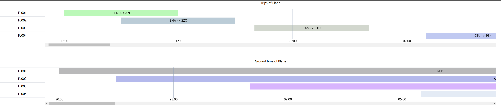
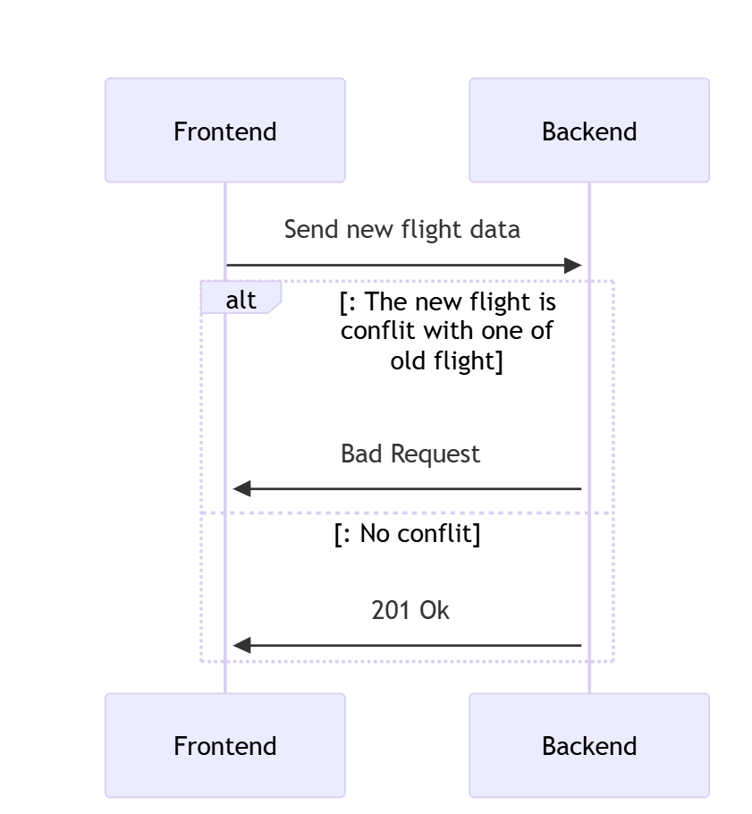
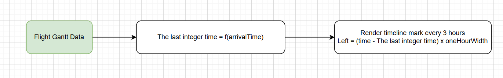
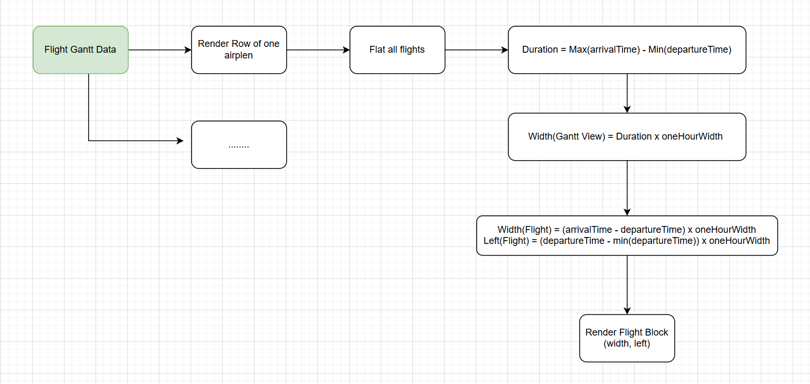
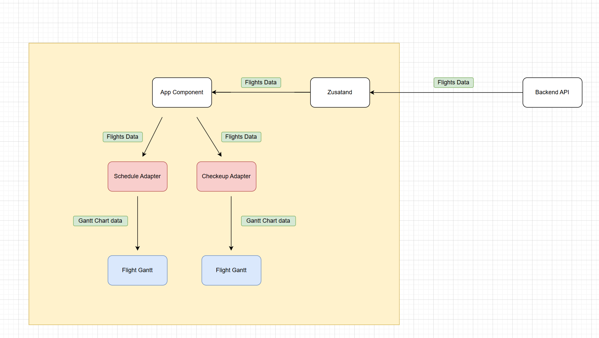

# Flight Schedule Display System - Technical Design Document

## 1. System Overview
The Flight Schedule Display System is a web-based application that visualizes flight and maintenance schedules using Gantt charts. The system consists of a React-based frontend for visualization and a NestJS backend for data management.




## 2. Architecture

### 2.1 High-Level Architecture
```
┌─────────────┐         ┌─────────────┐         ┌─────────────┐
│   Frontend  │ ←─HTTP─→│   Backend   │ ←─────→│  Database   │
│   (React)   │         │   (NestJS)  │         │  (MongoDB)  │
└─────────────┘         └─────────────┘         └─────────────┘
```

### 2.2 Backend Architecture
- **Framework**: NestJS with TypeScript
- **API Endpoints**:
  - POST `/api/flights` - Create new flight records


  

  - GET `/api/flights` - Retrieve flight schedules
- **Components**:
  - `FlightController`: Handles HTTP requests
  - `FlightService`: Implements business logic
  - `FlightModule`: Configures dependencies

### 2.3 Frontend Architecture
- **Framework**: React with TypeScript
- **State Management**: Zustand
- **Key Components**:
  - Flight Gantt Chart Component
  - Data Adapters for API Integration

## 3. Data Models

### 3.1 Flight Schema
```typescript
interface Flight {
  planeId: string;
  origin: string;
  destination: string;
  departureTime: string;
  arrivalTime: string;
}
```

## 4. Component Details

### 4.1 Backend Components
- **Flight Controller**:
  - Handles REST API endpoints
  - Implements input validation
  - Manages response formatting

- **Flight Service**:
  - Implements business logic
  - Handles data persistence
  - Manages flight scheduling rules

### 4.2 Frontend Components

#### 4.2.1 Component Structure
```
frontend/src/
├── components/
│   └── FlightGantt/
│       ├── FlightGanttSide/     # Side panel components
│       ├── FlightSchedule/      # Main schedule components
│       ├── index.tsx            # Main Gantt component
│       └── until.ts             # Utility functions
├── adapters/                    # API integration adapters
└── store.ts                     # State management
```

#### 4.2.2 Key Components

##### Flight Gantt Component
- **Purpose**: Main container component for flight scheduling visualization
- **Responsibilities**:
  - Coordinates between side panel and schedule display
  - Manages data flow between components
  - Handles time scale and view options

##### Flight Schedule Component
- **Purpose**: Renders the actual Gantt chart visualization
- **Features**:
  - Timeline rendering
  
  - Render each aircraft's schedule (flight or maintenance)

  

##### Flight Gantt Side Component
- **Purpose**: Render the aircraft list
- **Features**:
  - Render each aircraft's name

#### 4.2.3 Component Interactions



#### 4.2.4 State Management
- **Global State** (Zustand):
  - Flight data

#### 4.2.5 Data Flow
1. Data Fetching:
   - Call the back-end api to get all the flight data
2. Data format conversion
   - Convert flight data into flight Gantt chart data and maintenance Gantt chart data
3. Render Data
   - Render the flight Gantt chart
   - Render the maintenance Gantt chart   


## 5. API Endpoints

### 5.1 Create Flight
```
POST /flights
Content-Type: application/json

Request Body:
{
  "planeId": "FL003",
  "origin": "SZX",
  "destination": "PEK",
  "departureTime": "2025-01-07T18:00:00.000Z",
  "arrivalTime": "2025-01-07T21:00:00.000Z"
}
```

### 5.2 Get Flights
```
GET /flights
Content-Type: application/json

Response Body:
[
    {
        "_id": "6779f5bffb2aa92a0f8d54d4",
        "planeId": "FL003",
        "origin": "PEK",
        "destination": "CAN",
        "departureTime": "2025-01-04T09:00:00.000Z",
        "arrivalTime": "2025-01-04T12:00:00.000Z",
        "__v": 0
    }
]
```

## 6. Technologies Used

### 6.1 Backend
- NestJS
- TypeScript
- MongoDB
- Class-validator for validation

### 6.2 Frontend
- React
- TypeScript
- Zustand
- Tailwind CSS
