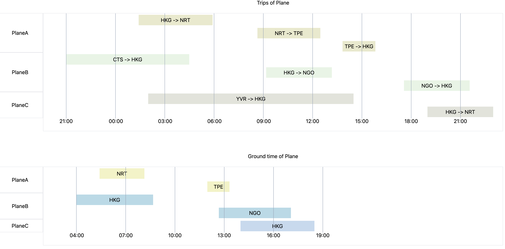

# Flight Schedule Display System - Technical Design Document

## Initialize the Project
The project is bootstrapped with Vite and consists of a frontend and backend component. Follow the steps below to set up and run the project.

Begin by clone the project repository to your local machine. Navigate to both the frontend and backend directories to install the necessary dependencies.

```bash
npm install
```
To initialize the React app, run the following command in the frontend directory, and it will be hosted at http://localhost:5173/
```bash
cd ../frontend
npm run dev
```
In a seperate terminal, navigate to backend directory and start the backend service, and the backend service will connect to the API hosted on MongoDB Altas.
```bash
npm start
```

##  System Overview
The Flight Schedule Display System is a web-based application designed to visualize flight and maintenance schedules through Gantt charts. This system provides an intuitive interface for users to easily track and manage flight operations and maintenance activities. The system consists of a React-based frontend for visualization and a NestJS backend for data management.




##  Architecture
### Backend Architecture
- **Framework**: NestJS with TypeScript
- **API Endpoints**:
  - POST `/api/flights` - Create new flight records

  

  - GET `/api/flights` - Retrieve flight schedules
- **Components**:
  - `FlightController`: Handles HTTP requests
  - `FlightService`: Implements business logic
  - `FlightModule`: Configures dependencies

### Frontend Architecture
- **Framework**: React with TypeScript
- **State Management**: Zustand
- **Key Components**:
  - Flight Gantt Chart Component
  - Data Adapters for API Integration

## Data Models

### Flight Schema
```typescript
interface Flight {
  planeId: string;
  origin: string;
  destination: string;
  departureTime: string;
  arrivalTime: string;
}
```

##  Component Details

### Backend Components
- **Flight Controller**:
  - Handles REST API endpoints
  - Implements input validation
  - Manages response formatting

- **Flight Service**:
  - Implements business logic
  - Handles data persistence
  - Manages flight scheduling rules

### Frontend Components

#### Component Structure
```
frontend/src/
├── components/
│   └── FlightGantt/
│       ├── FlightGanttSide/     # Side panel components
│       ├── FlightSchedule/      # Main schedule components
│       ├── index.tsx            # Main Gantt component
│       └── until.ts             # Utility functions
├── adapters/                    # API integration adapters
├── mocks/                       # mock data
└── store.ts                     # State management
```

#### Key Components

##### Flight Gantt Component
- **Purpose**: Main container component for flight scheduling visualization
- **Responsibilities**:
  - Coordinates between side panel and schedule display
  - Manages data flow between components
  - Handles time scale and view options

##### Flight Schedule Component
- **Purpose**: Renders the actual Gantt chart visualization
- **Features**:
  - Timeline rendering
  
  - Render each aircraft's schedule (flight or maintenance)

  

##### Flight Gantt Side Component
- **Purpose**: Render the aircraft list
- **Features**:
  - Render each aircraft's name

#### Component Interactions


#### State Management
- **Global State** (Zustand):
  - Flight data

#### Data Flow
1. Data Fetching:
   - Call the back-end api to get all the flight data
2. Data format conversion
   - Convert flight data into flight Gantt chart data and maintenance Gantt chart data
3. Render Data
   - Render the flight Gantt chart
   - Render the maintenance Gantt chart   


##  API Endpoints

###  Create Flight
```
POST /flights
Content-Type: application/json

Request Body:
{
  "planeId": "FL003",
  "origin": "SZX",
  "destination": "PEK",
  "departureTime": "2025-01-07T18:00:00.000Z",
  "arrivalTime": "2025-01-07T21:00:00.000Z"
}
```

###  Get Flights
```
GET /flights
Content-Type: application/json

Response Body:
[
    {
        "_id": "6779f5bffb2aa92a0f8d54d4",
        "planeId": "FL003",
        "origin": "PEK",
        "destination": "CAN",
        "departureTime": "2025-01-04T09:00:00.000Z",
        "arrivalTime": "2025-01-04T12:00:00.000Z",
        "__v": 0
    }
]
```

## Technologies Used

### 6.1 Backend
- NestJS
- TypeScript
- MongoDB
- Class-validator

### 6.2 Frontend
- React
- TypeScript
- Zustand
- Tailwind CSS
